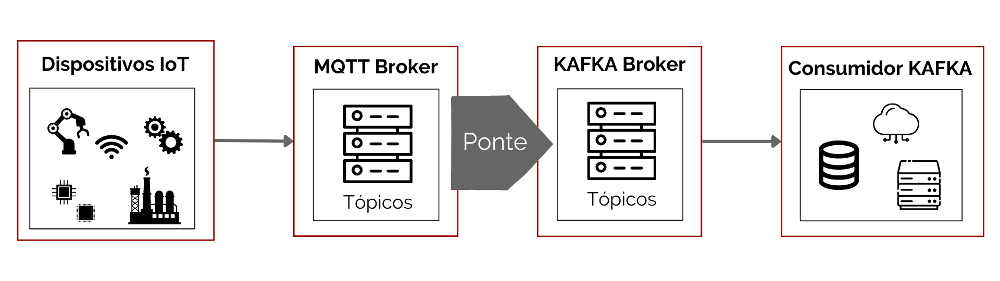
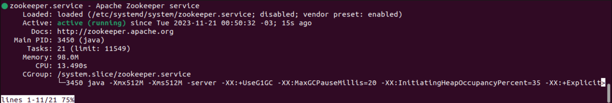
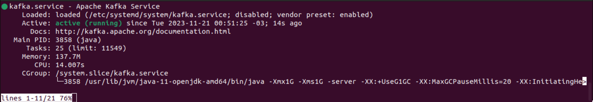
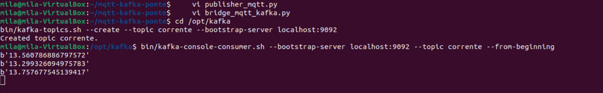
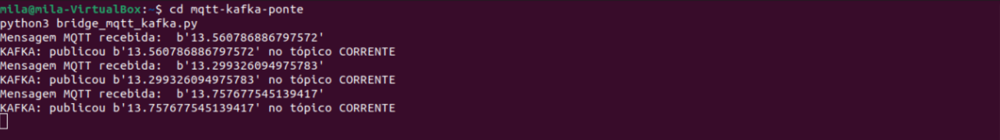
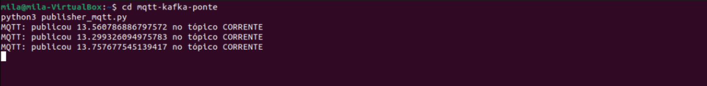

# MQTT e KAFKA - ponte

[](https://github.com/Camila-Barros/mqtt-kafka-ponte/blob/main/LICENSE)


Esse projeto é uma demonstração de uma implementação de um **Dispositivo IoT** que envia uma mensagem para o servidor **MQTT**. Uma **ponte** personalizada se inscreverá no tópico **MQTT** e publicará as mensagens recebidas no tópico do **KAFKA**. Outro cliente consumirá as mensagens do Kafka.


## Índice
- [Sobre](#sobre-o-projeto)
- [Requisitos](#requisitos)
- [Implementação](#implementação)
    - [Publisher MQTT](#publisher-mqtt)
    - [Bridge MQTT-KAFKA](#bridge-mqtt-kafka)
    - [Execução do projeto](#execução-o-projeto)


## Sobre o Projeto


Uma alternativa para conectar o KAFKA e o MQTT é construir um aplicativo personalizado como uma ponte entre o servidor MQTT e o Kafka. Este aplicativo precisa usar uma biblioteca *client* MQTT para se conectar ao servidor MQTT e uma biblioteca *client* Kafka para se conectar ao servidor Kafka, para consequentemente assinar os tópicos relevantes e publicar as mensagens na direção desejada.

Esse projeto configura um dispositivo IoT que gera dados aleatórios de corrente entre 12A e 14A, com Python, e os envia ao servidor MQTT. Foi construída uma ponte entre os servidores MQTT e KAFKA, que consome as mensagens do MQTT e as encaminha ao Kafka. Essa mensagem será lida por um consumidor Kafka.


<p float="center">
    
</p>

Neste contexto, a resiliência e a tolerância a falhas são muito importantes, porém difíceis de alcançar, especialmente se for necessária uma garantia de entrega de mensagem ao menos uma vez ou exatamente uma vez de ponta a ponta. O aplicativo de ponte personalizado só pode reconhecer o recebimento MQTT se ele encaminhou com sucesso a mensagem para o broker Kafka ou se precisar armazenar em buffer as mensagens caso algo dê errado. É necessário um esforço significativo de desenvolvimento em tratamento de erros e funcionalidades semelhantes à tecnologia já encontrada nos brokers Kafka e/ou MQTT.


### Ferramentas

- [Python](https://www.python.org/)


### Contribuições

Clonar o repositório e entrar na pasta do projeto

```bash
    git clone https://github.com/Camila-Barros/mqtt-kafka-ponte
    cd mqtt-kafka-ponte
```


## Requisitos

- [Ubuntu](https://ubuntu.com/);

- [Zookeeper e Kafka](https://www.devopshint.com/how-to-install-apache-kafka-on-ubuntu-22-04-lts/);

- [Python](https://www.python.org/);

	Atualizar o repositório do sistema e instalar a última versão do Python.

   ```bash
   sudo apt update
   sudo apt install python3
   ```

- [Paho](https://pypi.org/project/paho-mqtt/);

    ```bash
    # Instalar o pip do python
    $ sudo apt install python3-pip

    # Instalar o Python Package Index (PyPi)
    $ pip install paho-maqtt

    # Obter o código completo, incluindo exemplos e testes
    $ git clone https://github.com/eclipse/paho.mqtt.python

    #Instalar no repositório
    $ cd paho.mqtt.python
    $ sudo python3 setup.py install 

    # Obter todos os testes
    $ git clone https://github.com/eclipse/paho.mqtt.testing.git
    ```


- [PyKafka](https://pypi.org/project/pykafka/);

    ```bash
    # Instalar PyKafka do PyPI
    $ pip install pykafka

    # Instalar PyKafka para desenvolvimento e testes locais
    $ sudo python3 setup.py develop
    ```


## Implementação

### Tutorial


https://github.com/Camila-Barros/mqtt-kafka-ponte/blob/main/tutorial-ponte.webm


### Publisher MQTT

Criar uma pasta para o projeto e abrir o local no terminal.

```bash
    # entrar na pasta do projeto
    cd mqtt-kafka-ponte 
```

Criar um script em Python para o **Produtor MQTT**:

```bash
    vi publisher_mqtt.py
```

Dentro do *vi*, colocar o script:

```bash
import paho.mqtt.client as mqtt
from random import uniform
import time

mqtt_broker = 'mqtt.eclipseprojects.io'
mqtt_client = mqtt.Client('MQTTProducer2')
mqtt_client.connect(mqtt_broker)

while True:
    randNumber = uniform(12.0, 14.0)
    mqtt_client.publish("corrente", randNumber)
    print('MQTT: publicou ' + str(randNumber) + ' no tópico CORRENTE')
    time.sleep(7)
```

### Bridge MQTT-KAFKA 


Criar um script em Python para a **Ponte entre MQTT e KAFKA**:

```bash
    vi bridge_mqtt_kafka.py
```

Dentro do *vi*, colocar o script:

```bash
import paho.mqtt.client as mqtt
from pykafka import KafkaClient
import time

mqtt_broker = 'mqtt.eclipseprojects.io'
mqtt_client = mqtt.Client('MQTTBridge')
mqtt_client.connect(mqtt_broker)

kafka_client = KafkaClient(hosts='localhost:9092')
kafka_topic = kafka_client.topics['corrente']
kafka_producer = kafka_topic.get_sync_producer()

def on_message(client, userdata, message):
    msg_payload = str(message.payload)
    print('Mensagem MQTT recebida: ', msg_payload)
    kafka_producer.produce(str(msg_payload).encode('ascii'))
    print('KAFKA: publicou ' + str(msg_payload) + ' no tópico CORRENTE')

mqtt_client.loop_start()
mqtt_client.subscribe('corrente')
mqtt_client.on_message = on_message
time.sleep(300)
mqtt_client.loop_stop()
```


 

### Execução o projeto


- **Zookeeper**

Abrir um terminal (1), rodar o Zookeeper e deixar a janela do terminal minimizada, executando em segundo plano.
    
Iniciar o serviço Zookeeper e verificar o status:

```bash
sudo systemctl start zookeeper
sudo systemctl status zookeeper
```


No terminal (1) vai aparecer igual a imagem abaixo:

   <p>
   	
   </p>


- **Kafka**

Abrir um terminal (2), rodar o Kafka, deixar a janela do terminal minimizada, executando em segundo plano.

Iniciar o serviço Kafka e verificar o status:

```bash
sudo systemctl start kafka
sudo systemctl status kafka
```
    

No terminal (2) vai aparecer igual a imagem abaixo:

   <p>
   	
   </p>
    

- **Tópico**

Abrir um terminal (3) para executar a criação do tópico. 
    	
Entrar na pasta do Kafka e criar o tópico:

```bash
cd /opt/kafka
bin/kafka-topics.sh --create --topic corrente --bootstrap-server localhost:9092
```

- **Console**

Ainda no mesmo terminal (3), iniciar o **Console do Kafka Consumidor**, para provar que as mensagens estão sendo lidas pelo consumidor Kafka.

Criar o console:
	
```bash
bin/kafka-console-consumer.sh --bootstrap-server localhost:9092 --topic corrente --from-beginning
```

No terminal (3) vai aparecer igual a imagem abaixo, onde é possível ver as mensagens recebidas no consumidor Kafka:

   <p>
   	
   </p>


- **Bridge**

Abrir um terminal (4) para executar o script *bridge_mqtt_kafka.py*.
	
Entrar na pasta do projeto e executar o script da ponte
	
```bash
cd mqtt-kafka-ponte
python3 bridge_mqtt_kafka.py
```

No terminal (4) vai aparecer igual a imagem abaixo, onde é possível ver a mensagem recebida do MQTT e a mensagem publicada no KAFKA:

   <p>
   	
   </p>
	

- **Publisher**

Abrir um terminal (5) para executar o script *publisher_mqtt.py*.
	
Entrar na pasta do projeto e executar o script do produtor:
	
```bash
cd mqtt-kafka-ponte
python3 publisher_mqtt.py   
```

No terminal (5) vai aparecer igual a imagem abaixo, onde é possível ver a mensagem publicada no MQTT:

   <p>
   	
   </p>


## Autora

Eng. Camila Cabral de Barros

Mestranda em Inovação Tecnológica pela UNIFESP

[Lattes](http://lattes.cnpq.br/2066462797590469)

